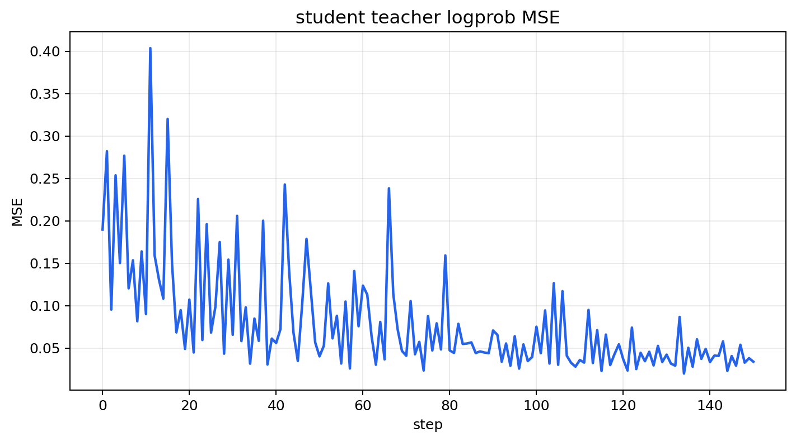

# CoreCoder_RL

[English](README.md) | [中文](README_CN.md)

CoreCoder_RL is a lightweight research project for agentic RL training built on [slime](https://github.com/THUDM/slime) and [CoreCoder](https://github.com/he-yufeng/CoreCoder).

## Project Contents

- `corecoder_rl/`: CoreCoder RL proxy service, rollout, and automated training code.
- `scripts/`: training scripts.
- `patches/corecoder_slime_overlay/`: FSDP training overlay.

## OPSD Training Flow

- The policy model samples on-policy responses through the CoreCoder RL proxy.
- A local or external model can optionally role-play the student and generate natural follow-up questions or feedback in teacher-student dialogues.
- The teacher observes the same generated student trajectory and computes `teacher_log_probs`.

## Example Result

## License

The CoreCoder_RL glue code in this repository is released under the MIT License. Upstream projects and copied/overlaid files remain governed by their original licenses. Please review the licenses of CoreCoder, slime, SGLang, Ray, Transformers, PyTorch, and the relevant models before redistribution or commercial use.

## Acknowledgements

This project is built upon the excellent work of [CoreCoder](https://github.com/he-yufeng/CoreCoder), [OpenClaw-RL](https://github.com/Gen-Verse/OpenClaw-RL), and [slime](https://github.com/THUDM/slime). We thank the authors of these projects.
