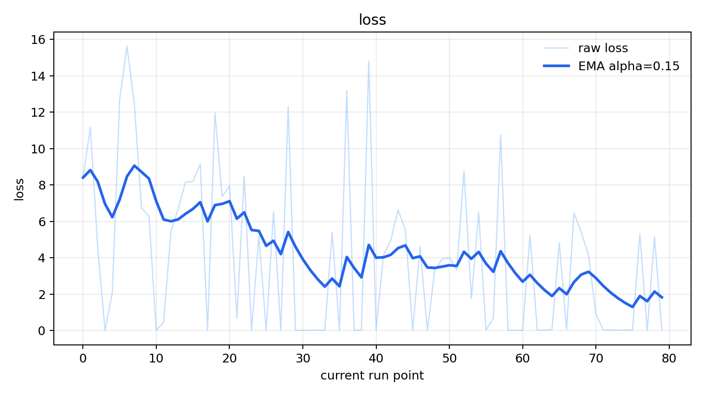

# CoreCoder_RL

[English](README.md) | [中文](README_CN.md)

CoreCoder_RL 是一个轻量级研究项目，基于 [slime](https://github.com/THUDM/slime)、[CoreCoder](https://github.com/he-yufeng/CoreCoder) 进行 agentic RL 训练。

## 项目内容

- `corecoder_rl/`：CoreCoder RL 代理服务、rollout 和自动化训练代码。
- `scripts/`：训练脚本。
- `patches/corecoder_slime_overlay/`：用于 FSDP 训练。

## OPSD 训练流程

- 策略模型通过 CoreCoder RL proxy 进行 on-policy 采样，生成回答。
- 教师模型观察同一条学生生成轨迹，并可结合题目、可选标准答案、工具信息和评分规则生成额外提示词。
- 计算 teacher 对学生轨迹 token 的 `teacher_log_probs`。
- 训练目标使用学生轨迹上的 student/teacher logprob 差异，使策略模型向教师在同一轨迹上的判断靠近。

## Tool-use 模块

CoreCoder_RL 支持 tool-use 训练。

实现了一个基于 python tool 的简单实验：训练数据从 GSM8K 题库中随机抽取，学生模型可以在有帮助时调用 Python。

## 示例效果

## License

本仓库中的 CoreCoder_RL glue code 使用 MIT License 发布。上游项目以及复制/覆盖的文件仍受其原始许可证约束。在重新分发或商业使用前，请分别检查 CoreCoder、slime、SGLang、Ray、Transformers、PyTorch 和模型许可证。

## 致谢

本项目基于以下精彩的项目构建：[CoreCoder](https://github.com/he-yufeng/CoreCoder)、[OpenClaw-RL](https://github.com/Gen-Verse/OpenClaw-RL)、[slime](https://github.com/THUDM/slime)，对这些项目的作者表示感谢。
